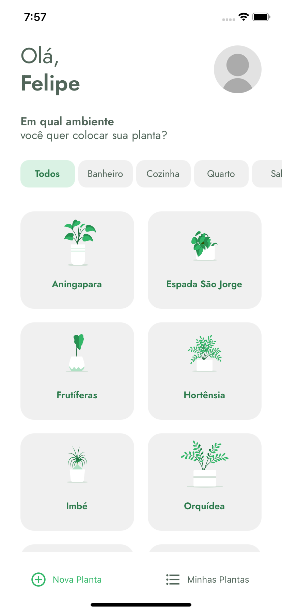
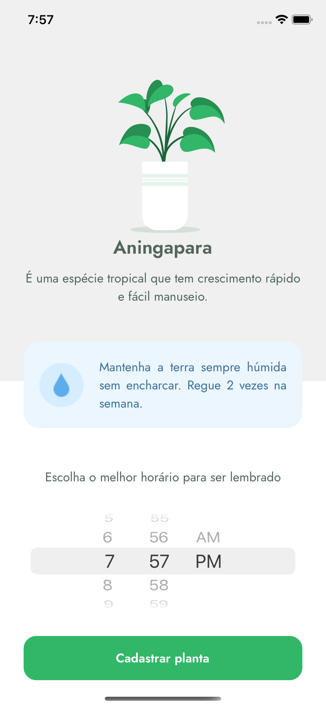
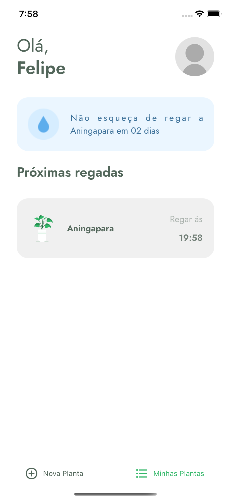
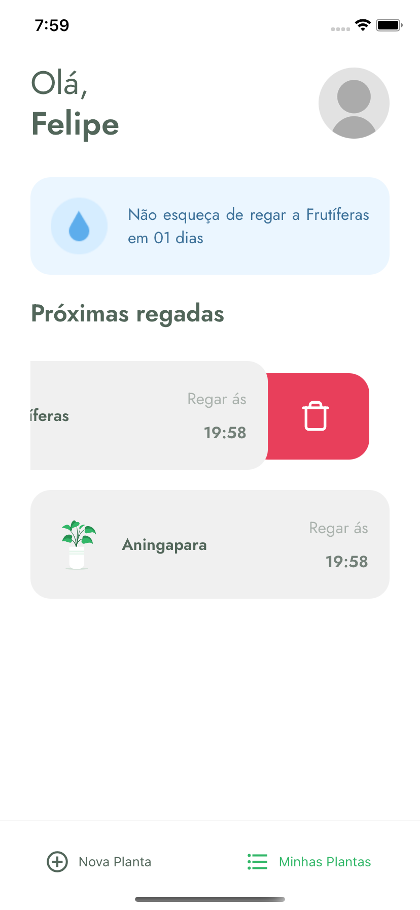

<p align="center">
  <a href="https://felipenascimento.dev">
    
  </a>
</p>

# Plant Manager

Este repositório é o resultado das aulas ministradas na NextLevelWeek 5 da [Rocketseat](https://rocketseat.com.br/).

Na semana criamos o aplicativo **Plant Manager** utilizando React Native, **Styled Components** (Extra aulas) e React Navigation 5.

Este projeto utiliza o [Expo](https://expo.io/).

> Eu fiz o meu projeto utilizando o [Typescript](https://www.typescriptlang.org/) para adicionar tipagem e alguns outros recursos a linguagem [Javascript](https://pt.wikipedia.org/wiki/JavaScript)

## Preview

<p align="center">
  
  
</p>

<p align="center">
  
  
</p>

<p align="center">
  
</p>

## Instalação

Você precisará ter apenas o [NodeJS](https://nodejs.org) instalado na sua máquina, e após isso, clonar este repositório:

```sh
  $ git clone https://github.com/FelipeNascimentoRJ/plant-manager.git
```

Depois disso acesse a pasta da aula que você deseja e instale as dependências executando o seguinte comando:

```sh
  $ yarn install # ou npm install
```

## Executando a aplicação

Execute o comando a baixo para inicializar o Expo:

```sh
  $ yarn start # ou npm start
```

Agora basta abrir o emulador pelo seu computador, ou o aplicativo do Expo no seu celular (disponível na [App Store](https://apps.apple.com/br/app/expo-client/id982107779) e na [Google Play](https://play.google.com/store/apps/details?id=host.exp.exponent&hl=pt_BR)).